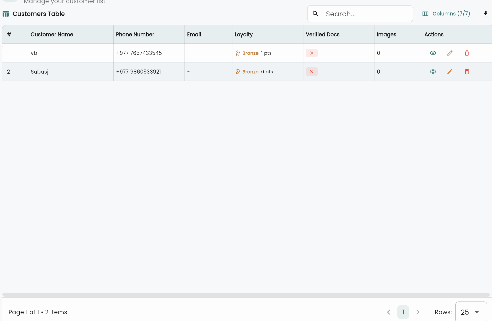

# DynamicDataTable

A production-grade, highly customizable Flutter data table widget with sorting, filtering, pagination, row selection, and pluggable export formats. **100% pub.dev ready** with zero app-level dependencies.

## Features

✅ **Row Selection** - Checkboxes with select-all functionality  
✅ **Loading & Error States** - Spinner overlay & error messaging  
✅ **Sort Indicators** - Visual arrows with hover tooltips  
✅ **Search & Filter** - Local & remote search support  
✅ **Pagination** - Page navigation with size selection  
✅ **Export System** - Pluggable Excel/CSV/custom formats  
✅ **i18n Ready** - All strings in `TableConfig`  
✅ **Accessibility** - Semantic widgets & ARIA labels  
✅ **Custom Builders** - Cell, filter, & export value builders  
✅ **Date Filter** - Calendar picker UI  

## Demo



*Customers table built with DynamicDataTable featuring search, filtering, sorting, row selection, and bulk actions.*

## Quick Start

```dart
import 'package:dynamic_data_table/dynamic_data_table.dart';

class MyTable extends StatefulWidget {
  @override
  State<MyTable> createState() => _MyTableState();
}

class _MyTableState extends State<MyTable> {
  @override
  Widget build(BuildContext context) {
    return DynamicDataTable<Item>(
      data: items,
      columns: [
        ColumnDef<Item>(
          id: 'name',
          label: 'Product Name',
          sortable: true,
          cellBuilder: (item) => DataCell(Text(item.name)),
        ),
        ColumnDef<Item>(
          id: 'price',
          label: 'Price',
          sortable: true,
          cellBuilder: (item) => DataCell(Text('\$${item.price}')),
        ),
      ],
      config: TableConfig(
        searchHint: 'Search products...',
        enableRowSelection: true,
      ),
    );
  }
}
```

## Core Features

### 1. Row Selection

Enable bulk operations with checkbox column:

```dart
DynamicDataTable<Item>(
  enableRowSelection: true,
  onRowSelectionChanged: (selectedItems) {
    setState(() => selected = selectedItems);
  },
  config: TableConfig(selectAllLabel: 'Select All Items'),
)
```

### 2. Loading & Error States

Show spinners and error messages:

```dart
DynamicDataTable<Item>(
  loadingState: isLoading ? TableLoadingState.loading : TableLoadingState.idle,
  errorMessage: error?.message,
)
```

### 3. Sort Indicators

Visual sorting with column clicks:

```dart
ColumnDef<Item>(
  id: 'name',
  label: 'Name',
  sortable: true,  // Show up/down arrow
  onSort: (index, ascending) => fetchSorted(ascending),
)
```

### 4. Search & Filter

Local and remote search:

```dart
DynamicDataTable<Item>(
  onSearch: (term) => fetchRemoteData(term),
  searchStringBuilder: (item) => '${item.name} ${item.id}',
)
```

### 5. Pagination

Navigate large datasets:

```dart
DynamicDataTable<Item>(
  pagination: Pagination(page: 1, limit: 25, totalPages: 10),
  onPageChanged: (newPage, pageSize) => fetchPage(newPage),
)
```

### 6. Custom Export

Pluggable export formats:

```dart
class CsvExporter extends TableExporter {
  @override
  String get format => 'csv';
  
  @override
  Future<void> export<T>({...}) async { ... }
}
```

### 7. i18n Configuration

All strings centralized in `TableConfig`:

```dart
config: TableConfig(
  searchHint: context.l10n.search,
  filterLabel: context.l10n.filter,
  exportLabel: context.l10n.export,
)
```

### 8. Date Filtering

Calendar-based filtering:

```dart
DynamicDataTable<Item>(
  enableDateFilter: true,
  onDateFilterChanged: (filter) => refetch(filter),
)
```

## API Reference

### DynamicDataTable<T>

Main widget class.

**Parameters:**
- `data` - List of items to display
- `columns` - List of `ColumnDef<T>` column definitions
- `config` - `TableConfig` with settings & i18n strings
- `enableRowSelection` - Show checkbox column (default: false)
- `onRowSelectionChanged` - Callback with selected items
- `loadingState` - `TableLoadingState.idle`, `.loading`, or `.error`
- `errorMessage` - Error text to display when state is `.error`
- `pagination` - `Pagination` object for page info
- `onPageChanged` - Callback on page/size change
- `onSearch` - Remote search callback
- `searchStringBuilder` - Build searchable text per item
- `enableDateFilter` - Show date filter (default: false)
- `onDateFilterChanged` - Date range selection callback
- `onRowTap` - Row click handler
- `emptyState` - Custom empty state widget

### ColumnDef<T>

Column configuration.

**Parameters:**
- `id` - Unique column identifier
- `label` - Display name
- `sortable` - Enable sort UI (default: true)
- `exportable` - Include in exports (default: true)
- `filterable` - Show filter button (default: true)
- `cellBuilder` - Custom cell widget
- `filterValueBuilder` - Extract filter value
- `exportValueBuilder` - Custom export value
- `resizable` - Allow width changes (default: true)
- `flexFactor` - Column flex allocation (default: 1)
- `size` - ColumnSize.S, .M, .L
- `onSort` - Sort callback

### TableConfig

Configuration object with strings & flags.

**Parameters:**
- `searchHint` - Placeholder text
- `filterLabel` - Filter button label
- `exportLabel` - Export button label
- `selectAllLabel` - Select all checkbox label
- `applyLabel` - Dialog apply button
- `cancelLabel` - Dialog cancel button
- `enableRowSelection` - Feature flag
- `enableLoadingState` - Feature flag
- `enableSortIndicators` - Feature flag
- `enableKeyboardNavigation` - Feature flag
- `canExport` - Permission callback: `() => bool`

## Advanced Usage

### Custom Cell Builder

```dart
ColumnDef<Item>(
  id: 'status',
  label: 'Status',
  cellBuilder: (item) => DataCell(
    Container(
      padding: EdgeInsets.symmetric(horizontal: 8, vertical: 4),
      decoration: BoxDecoration(
        color: item.status == 'Active' ? Colors.green : Colors.red,
        borderRadius: BorderRadius.circular(4),
      ),
      child: Text(item.status),
    ),
  ),
)
```

### Remote Search with Debounce

```dart
DynamicDataTable<Item>(
  onSearch: (term) {
    if (term.isEmpty) {
      fetchAllItems();
    } else {
      searchRemote(term);
    }
  },
)
```

### Bulk Actions on Selection

```dart
if (selectedItems.isNotEmpty) {
  ElevatedButton(
    onPressed: () => bulkDelete(selectedItems),
    child: Text('Delete ${selectedItems.length}'),
  )
}
```

## Testing

```dart
testWidgets('selects rows', (tester) async {
  final items = [Item(id: '1', name: 'Test')];
  
  await tester.pumpWidget(
    MaterialApp(
      home: DynamicDataTable<Item>(
        data: items,
        columns: [...],
        enableRowSelection: true,
        config: TableConfig(),
      ),
    ),
  );
  
  expect(find.byType(Checkbox), findsWidgets);
});
```

## FAQ

**Q: How do I add custom export formats?**  
A: Extend `TableExporter` and pass to the config.

**Q: Is this i18n compatible?**  
A: Yes, all strings are in `TableConfig`. Pass localized strings per language.

**Q: Does it support infinite scroll?**  
A: Not yet, but pagination works for large datasets.

**Q: Can I customize colors/theme?**  
A: Yes, use Flutter's `Theme` data and custom cell builders.

## Troubleshooting

**Empty table shows no data?**  
Check `data` is populated and `columns` have `cellBuilder`.

**Sort not working?**  
Ensure column has `sortable: true` and `onSort` callback.

**Export button not showing?**  
Check `canExport()` returns `true` in `TableConfig`.

**Performance slow with large datasets?**  
Use pagination or implement virtual scrolling with the custom builder.

## License

MIT

## Contributing

Contributions welcome! File issues or PRs at the repo.

## Support

For issues, questions, or feature requests, visit the [GitHub repository](https://github.com/subash9860/dynamic_data_table).
